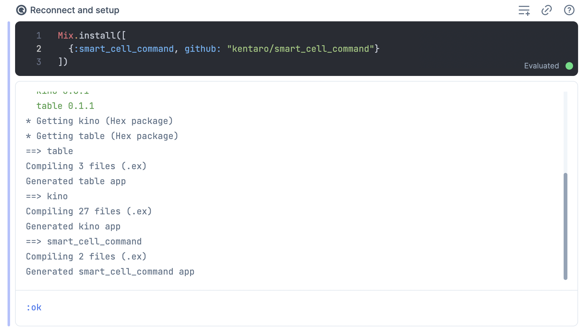
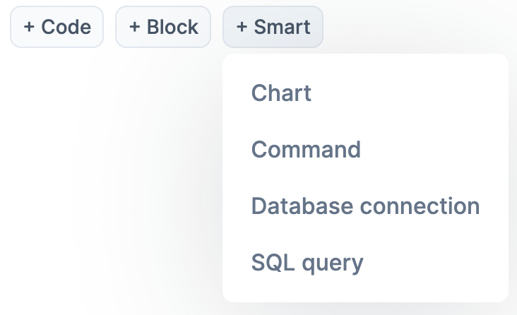
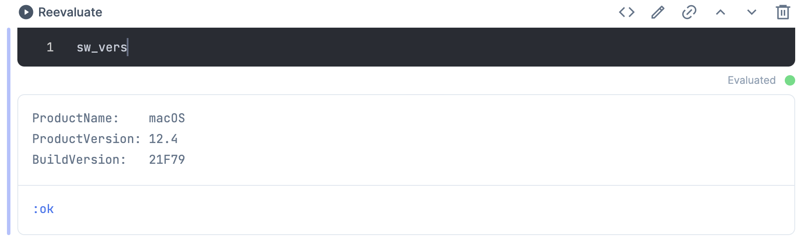
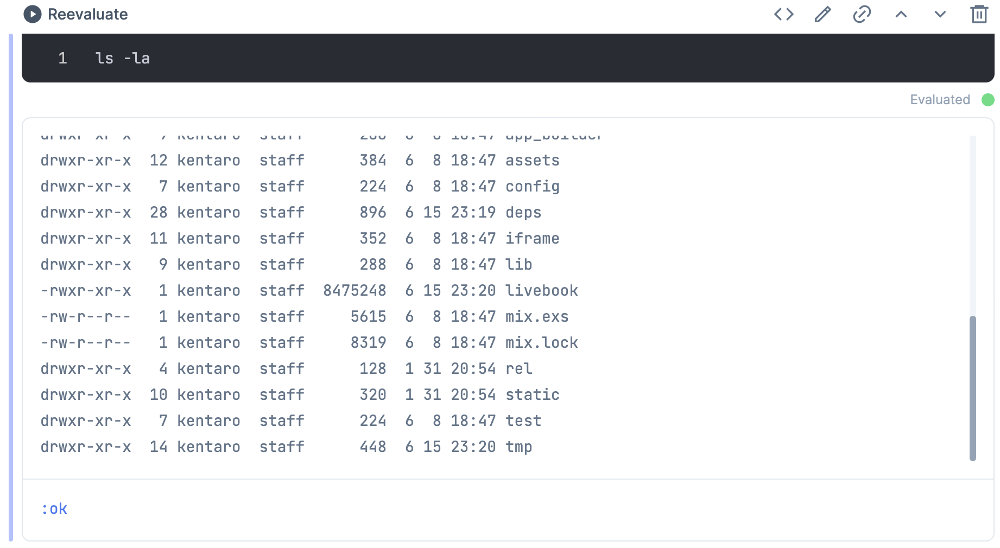
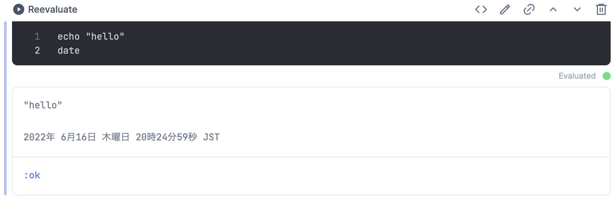

# SmartCellCommand

A smart cell implementation for Livebook to execute shell commands.

## Installation

Use `Mix.install/2` on your livebook to install this library.

```elixir
Mix.install([
  {:smart_cell_command, github: "kentaro/smart_cell_command"}
])
```



## Usage

Select the `Command` cell from `+ Smart` button:



Then you'll see the editor like below:


### Execute a single command



### Execute a command with args



### Execute multiple commands



## Author

Kentaro Kuribayashi <kentarok@gmail.com>
